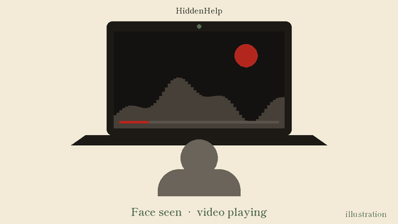

# HiddenHelp

Walk away from your screen and the video pauses. Come back and it plays again.

<p align="center">
  
  <br><sub>Illustration of the behaviour, not a screen recording.</sub>
</p>

## How it works

1. The webcam is read at 320x240 to keep CPU use low.
2. Once a second, an OpenCV Haar cascade looks for a face in the frame.
3. If no face has been seen for a short while, the app sends a keypress to the focused window, which pauses the video.
4. When a face shows up again, it sends the same key, which resumes it.

Frames never leave your machine. Nothing is saved or uploaded.

## Two ways to run it

| | `gui.py` | `main.py` |
|---|---|---|
| Interface | Desktop window with a live camera view, status and start/stop button | Plain OpenCV window |
| Key it sends | `Space` (works in most players) | `K` (YouTube's play/pause key) |
| Pauses after | 2.5 s without a face | 1.5 s without a face |

## Run it

Needs Python 3.9+ and a webcam.

```bash
pip install -r requirements.txt
python gui.py      # or: python main.py
```

Then open your video and click on it so its window has focus. HiddenHelp presses keys in whatever window is focused, so keep the video in front.

Quit with the **Quit App** button in `gui.py`, or press `q` in the `main.py` window.

## Built with

Python, OpenCV (face detection), PyAutoGUI (keypresses), CustomTkinter (desktop UI), Pillow.
